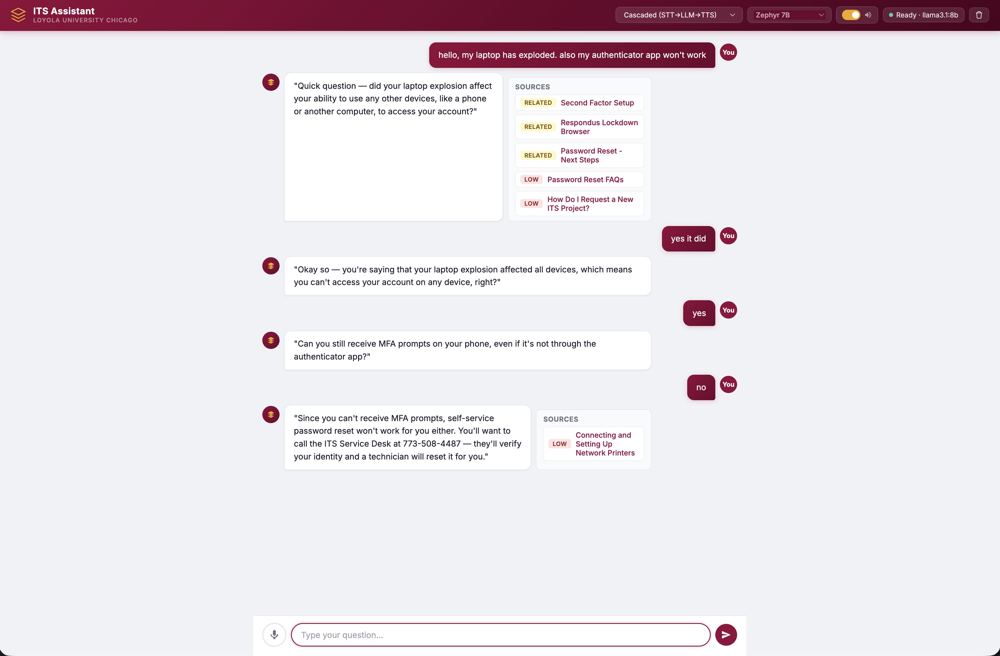

# ITS Voice Bot

Voice-first RAG chatbot for Loyola ITS support, with an optional full-duplex
voice mode powered by moshi-mix TTS.



## Requirements

- **Python 3.11** — required. Python 3.13+ will fail because `moshi-personaplex`
  pins `torch<2.5`, and torch only ships 3.13+ wheels from 2.5 onward. There is
  no workaround; use 3.11.

## Setup

```bash
# 1. Create a Python 3.11 virtual environment
python3.11 -m venv .venv311
source .venv311/bin/activate   # Windows: .venv311\Scripts\activate

# 2. Install all dependencies (single unified requirements file)
pip install -r requirements.txt
#
# This installs the full stack: web framework, Whisper STT, Edge TTS,
# RAG (FAISS + sentence-transformers), and the vendored NVIDIA
# PersonaPlex / Moshi fork for full-duplex voice.
#
# pip will downgrade sphn and huggingface-hub from any newer versions —
# that is expected and required for PersonaPlex to load correctly.

# 3. Ingest documents (first time only)
python scripts/ingest_docs.py

# 4. (Optional) Start Ollama for local LLM inference
ollama serve
ollama pull llama3.1:8b

# 5. Run the server
uvicorn app.main:app --reload
```

Open http://127.0.0.1:8000 in your browser.

## Usage

- **Text**: Type in the input box and press Enter
- **Voice (cascaded)**: Click the mic button, speak, click again to stop.
  Uses faster-whisper STT → LLM → Edge TTS.
- **Voice (PersonaPlex)**: Select "PersonaPlex (local, full-duplex)" from the
  Engine dropdown. On first connect the server downloads `nvidia/personaplex-7b-v1`
  (~15 GB) and warms up the model — this takes several minutes. Once ready the
  mic streams directly into the speech-to-speech model with no separate STT/TTS
  step.
- **Audio output**: Toggle the speaker icon to enable/disable TTS playback.
- **LLM model**: Switch between remote HuggingFace models or local Ollama from
  the model dropdown.

## Voice Engines

| Engine | How it works | Best for |
|--------|-------------|----------|
| Cascaded (default) | Browser mic → Whisper STT → LLM → Edge TTS | Any machine, no GPU needed |
| PersonaPlex | Full-duplex speech-to-speech 7B model | Best conversational quality; needs GPU / Apple Silicon MPS |

The device is auto-detected (CUDA → MPS → CPU). To force a device set
`PERSONAPLEX_DEVICE=cpu` in your `.env`.

## Configuration

Copy `.env.example` to `.env` and set values as needed:

```bash
# LLM — HuggingFace (remote, free tier)
HF_CHAT_MODEL=tiiuae/zephyr-7b-instruct
HF_TOKEN=<your-hf-token>

# LLM — local Ollama (fallback if HF_CHAT_MODEL unset)
OLLAMA_BASE_URL=http://localhost:11434
OLLAMA_MODEL=llama3.1:8b

# STT — leave empty for local faster-whisper, or set "openai" for OpenAI Whisper API
STT_API=
OPENAI_API_KEY=<your-openai-key>   # only needed if STT_API=openai

# PersonaPlex
PERSONAPLEX_DEVICE=          # auto (cuda > mps > cpu); set to force
PERSONAPLEX_ENABLED=true
HF_REPO=nvidia/personaplex-7b-v1
DEFAULT_VOICE_PROMPT=NATF2
```

## Deployment

The app is container-friendly. Two primary paths:

### Heroku (containers)

```bash
heroku login
heroku create my-its-voice-bot

heroku config:set HF_CHAT_MODEL="tiiuae/zephyr-7b-instruct" \
                  HF_TOKEN="<your-hf-token>"

heroku container:push web --app my-its-voice-bot
heroku container:release web --app my-its-voice-bot
heroku logs --tail --app my-its-voice-bot
```

The included `heroku.yml` and `Dockerfile` handle the build. PersonaPlex is not
suitable for Heroku (no GPU, 30-second request timeout) — set
`PERSONAPLEX_ENABLED=false` for cloud deployments.

### Any other host

Use the same Dockerfile or run `uvicorn` directly on a VM with Python 3.11.
Copy `data/faiss/faiss.index` (or re-run `scripts/ingest_docs.py`). Set env
vars for your LLM backend.

### Remote STT note

`STT_API=hf` (HuggingFace ASR) is non-functional as of early 2026 — no free
providers serve ASR models via the HF router. Use `STT_API=openai` with an
OpenAI key, or leave it unset to use local faster-whisper (recommended for
best accuracy).
